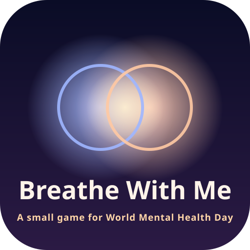
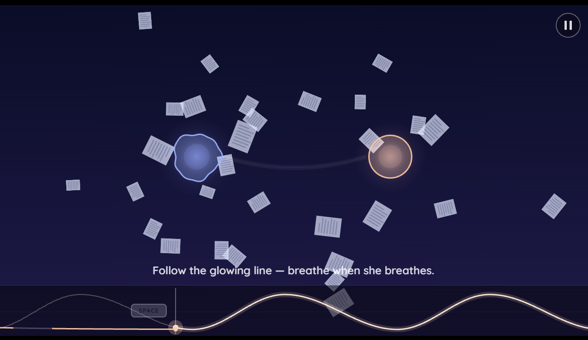

<p align="center">
  
</p>

<h1 align="center">Breathe With Me</h1>

<p align="center"><em>A small game for World Mental Health Day</em></p>

<p align="center"><strong><a href="https://breathe-with-me-game.vercel.app">Play it in your browser →</a></strong></p>

<p align="center">
  
</p>

## About

Breathe With Me is a short game about being there for someone. You don't have superpowers. You help people through a moment of panic just by breathing with them: first at their pace, then a little slower, until they calm down with you.

You meet a student the night before a thesis defense, a new parent awake at 3 AM, a software developer the night before a release, and an older man who lives alone. At the end, the storm is yours, and the people you helped come back to breathe with you.

Released for World Mental Health Day, October 10, 2026.

## How to play

| Input    | Breathe in                  | Breathe out      | Pause                       |
| -------- | --------------------------- | ---------------- | --------------------------- |
| Keyboard | Hold **Space**              | Release          | **Esc**                     |
| Mouse    | Hold the left button        | Release          | **Esc** or the pause button |
| Touch    | Hold anywhere on the screen | Lift your finger | The pause button, top right |
| Gamepad  | Hold **A**                  | Release          | **Start**                   |

Follow the glowing line at the bottom of the screen. Each person has up to three phases:

1. **Match**: breathe at their pace until you're in sync.
2. **Lead**: breathe a little slower each breath, and they slow down with you.
3. **Stay steady**: when their panic spikes, don't rush with them. Keep your own calm pace.

## Features

- A one-button rhythm game where you lead the beat instead of following it
- Five short levels, each with its own palette, inner weather and music
- Music that follows the breath: the tempo slows down as the person calms
- A guided first level that teaches everything as you play
- Speech bubbles for what people say, and drifting thoughts for what they don't
- A calm ring for progress, a panic meter, and a gentle retry when it fills
- Hearts for how much of each level you spent in sync
- Keyboard, mouse, touch and gamepad support, on desktop and mobile browsers
- "Reduce motion & flashes" option that removes shake, glitch and flicker
- No accounts, no tracking, no network calls: progress is saved in your browser

## Tech stack

TypeScript, Vite, PixiJS (rendering), Tone.js (synthesized audio) and Electron (Windows build).

## Run locally

Requires Node.js 20 or newer.

```bash
npm install
npm run dev            # browser, with hot reload
npm run dev:electron   # Electron window against the dev server
```

## Build

**Web (Vercel)**

```bash
npm run build:web      # static build into dist/
```

On Vercel, import the repository and keep the defaults from `vercel.json`: build command `npm run build:web` and output directory `dist`. Set `VITE_SITE_URL` in `.env.production` (or as a Vercel environment variable) to the site's final URL so the sharing previews use absolute links.

**Windows installer**

```bash
npm run dist:win       # NSIS installer + portable exe into release/
```

**Images**

The icons, favicons, PWA icons and sharing image are generated from `assets/icon.svg` and `assets/og-image.svg`. After editing either one, run:

```bash
npm run assets
```

## Deployment

Vercel deploys the site straight from GitHub. GitHub Actions
(`.github/workflows/ci.yml`) only runs the checks.

| Branch       | GitHub Actions    | Vercel                               |
| ------------ | ----------------- | ------------------------------------ |
| `master`     | type-check, build | production deployment                |
| `develop`    | type-check, build | preview deployment                   |
| pull request | type-check, build | preview deployment, linked on the PR |

CI type-checks with `tsc --noEmit`. The Vercel build does not: `vercel.json`
runs `build:web`, which skips TypeScript for a faster deploy. The two are
worth keeping side by side.

**One-time setup**

1. In the Vercel dashboard, **Add New → Project**, import this repository and
   deploy. `vercel.json` already supplies the build command
   (`npm run build:web`) and the output directory (`dist`), so the detected
   defaults are correct as they stand.
2. Under **Settings → Git**, check that the production branch is `master`.
   Every other branch, and every pull request, then gets a preview deployment.
3. Set `VITE_SITE_URL` in `.env.production` to the site's final URL, so the
   sharing previews use absolute links, and update the "Play it in your
   browser" link at the top of this file.

Vercel deploys in parallel with CI rather than waiting for it, so protect
`master` (**Settings → Branches** on GitHub) and require the
**Type-check & build** check to pass before a merge. Without that, code that
does not compile can still reach production.

**Deploying by hand**

```bash
npx vercel           # preview deployment
npx vercel --prod    # production deployment
```

## Project structure

```
src/
  audio/    synthesized music, breath and heartbeat sounds
  breath/   the breathing model: player, person, guide line, scoring
  core/     game loop, scenes, input, save, settings, platform checks
  data/     levels.ts (all tuning), text.ts (all strings), links.ts
  fx/       circles, weather, bloom and other visuals
  scenes/   title, city map, levels, ending, menus
  ui/       HUD, cards, menus, tutorial
electron/   desktop wrapper (main + preload)
assets/     SVG sources for the logo, icon and sharing image
public/     generated web icons, manifest and sharing image
scripts/    asset generator
```

## Credits

Made by Dede Rian.

All visuals are drawn procedurally in code, and all music and sound effects are synthesized at runtime. The game uses no image or audio files.

Font: [Quicksand](https://fonts.google.com/specimen/Quicksand) by Andrew Paglinawan, licensed under the SIL Open Font License 1.1.

## If you're struggling

Please talk to someone you trust. You can find a free, confidential helpline near you at [findahelpline.com](https://findahelpline.com).

## License

[MIT](LICENSE) © 2026 Dede Rian
